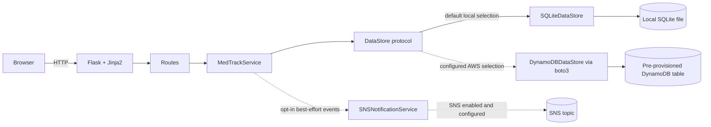
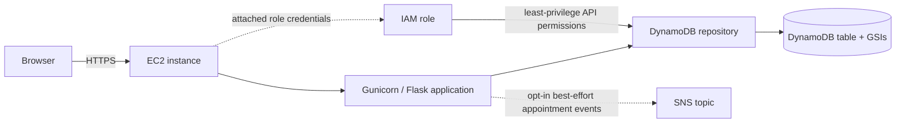

# MedTrack architecture

## Current local architecture

The application is a server-rendered Flask application. A browser submits forms and receives Jinja2 pages. Flask route modules handle authentication, patient workflows, and doctor workflows. `MedTrackService` owns validation and business operations; its repository dependency is described by the `DataStore` protocol in `services/data_store.py`. `SNSNotificationService` is optional and disabled by default.

The app factory reads `MEDTRACK_DATA_STORE`. When unset, it selects `SQLiteDataStore`, creates the local schema, and uses `instance/medtrack.sqlite3`. This is the current local runtime. The repository returns Python dictionaries/lists and uses UUID identifiers.

SQLite initializes users, appointments, diagnoses, vitals, pre-visit intakes, follow-ups, timeline events, and in-app notifications for a fresh database. It adds consultation columns additively. A legacy integer-ID users table is detected and left unchanged; startup stops with instructions to use a new database path rather than attempting destructive conversion.

## Implemented AWS data path

When configured with `MEDTRACK_DATA_STORE=dynamodb`, the app factory selects `DynamoDBDataStore`. That implementation uses boto3's DynamoDB API and the default AWS credential provider chain. The table is not created by the application; `DYNAMODB_TABLE_NAME` and the expected table/index schema must already exist. The adapter is lazy and makes no AWS request when the app starts.

## Intended AWS hosting and notifications

The intended future hosting path is browser → EC2-hosted Flask application → DynamoDB. An IAM role attached to EC2 would provide AWS credentials through boto3's default provider chain. Patients and doctors remain application users authenticated by Flask; they are not IAM users.

SNS publishing is an optional service integration for appointment request creation and status changes. It is disabled by default and sends only event name, appointment ID, and new status where applicable; it does not send diagnosis/history information. Failures are swallowed after safe logging, so SNS is not required for the appointment workflow.

The DynamoDB repository stores these additional entities in its existing single table: intake items under appointment partitions, patient histories on GSI2, doctor worklists on GSI3, and notifications under user partitions. It retains the existing PK/SK plus three GSI schema; application code does not provision tables or indexes. See [DynamoDB Design](DYNAMODB_DESIGN.md).

Local mode is **Browser → Flask → SQLite**, with SNS disabled. AWS target mode is **Browser → EC2/Flask → DynamoDB**, with optional SNS appointment notifications. The second diagram is an intended architecture, not a deployed topology. `wsgi.py` exposes the Flask application for Gunicorn, but no EC2 instance, IAM role, DynamoDB resources, or SNS topic has been deployed or verified.

## AWS activation boundary

The project owner reports that AWS currently presents the account activation/setup page. Therefore this project has not provisioned AWS resources or validated the boto3 repository against an AWS table. Activation, table/index provisioning, IAM role setup, SNS setup, EC2 deployment, and live verification remain future work.
